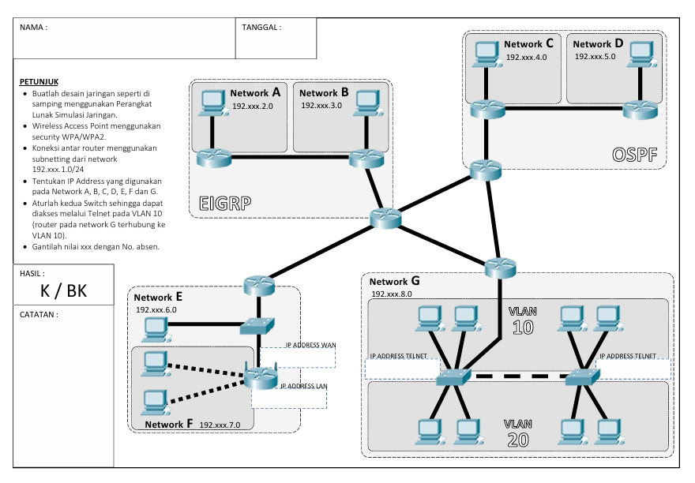

# Cisco Packet Tracer Network Project UJK 22 11 25

## Project Overview
This document provides complete configuration for a multi-protocol network using EIGRP, OSPF, and BGP with VLAN segmentation and remote management via Telnet.

---

## Network Topology



---

## IP Addressing Scheme

### Network EIGRP Table

| Network | Network Address | CIDR | Subnet Mask | Purpose | Protocol | SE |
|---------|----------------|------|-------------|---------|----------|----- |
| NET-A LAN | 192.4.2.0 | /24 | 255.255.255.0 | Client Network A | EIGRP 111 | 192.4.1.0/30
| NET-B LAN | 192.4.3.0 | /24 | 255.255.255.0 | Client Network B | EIGRP 111 | 192.4.1.0/30 - 192.4.1.4/30 

### Configuration EIGRP 111 
```shell
NET A

router eigrp 111
network 192.4.2.0 0.0.0.255
network 192.4.1.0 0.0.0.3
no auto-summary 

NET B

router eigrp 111
network 192.4.3.0 0.0.0.255
network 192.4.1.0 0.0.0.3
network 192.4.1.4 0.0.0.3
no auto-summary 


ROUTER-BRIDGE | BGP 100

router eigrp 111
network 192.4.1.4 0.0.0.3
network 192.4.1.16 0.0.0.3
network 192.4.1.28 0.0.0.3
network 192.4.1.24 0.0.0.3
redistribute bgp 100 metric 1544 2000 255 1 1500
no auto-summary 

router bgp 100
neighbor 192.4.1.18 remote-as 200
neighbor 192.4.1.26 remote-as 300
neighbor 192.4.1.30 remote-as 400
redistribute eigrp 111
no auto-summary 
```


### Network OSPF Table

| Network | Network Address | CIDR | Subnet Mask | Purpose | Protocol | SE |
|---------|----------------|------|-------------|---------|----------|----- |
| NET-C LAN | 192.4.4.0 | /24 | 255.255.255.0 | Client Network C | OSPF 222 | 192.4.1.8/30-192.4.1.12/30
| NET-D LAN | 192.4.5.0 | /24 | 255.255.255.0 | Client Network D | OSPF 222 | 192.4.1.8/30 

### Configuration  222 
```shell
NET C

router OSPF 222
network 192.4.4.0 0.0.0.255 area 0 
network 192.4.1.8 0.0.0.3 area 0 
network 192.4.1.12 0.0.0.3 area 0 


NET D

router OSPF 222
network 192.4.5.0 0.0.0.255 area 0 
network 192.4.1.8 0.0.0.3 area 0 


ROUTER-BRIDGE | BGP 200

router ospf 222
network 192.4.1.12 0.0.0.3 area 0
network 192.4.1.16 0.0.0.3 area 0 
network 192.4.1.20 0.0.0.3 area 0 
redistribute bgp 200 subnets


router bgp 200
neighbor 192.4.1.17 remote-as 100
neighbor 192.4.1.22 remote-as 300
redistribute ospf 222 
```

### Network VLAN Table

| Network | Network Address | CIDR | Subnet Mask | Purpose | Protocol | SE |
|---------|----------------|------|-------------|---------|----------|----- |
| NET-G LAN | 192.4.8.0 | /24 | 255.255.255.0 | Client Network VLAN | - | 192.4.1.20/30-192.4.1.24/30

### Configuration NET G 
```shell
ROUTER-BRIDGE | BGP 300

router bgp 300
neighbor 192.4.1.25 remote-as 100
neighbor 192.4.1.21 remote-as 200
redis connec


SWITCH 1-2

! Telnet Configuration
line vty 0 4
 password cisco123
 login
 transport input telnet
 exec-timeout 10 0

! Console Configuration
line console 0
 password console123
 login
 logging synchronous
 exec-timeout 0 0

! Enable Password
enable secret class123

! Save Configuration
end
write memory
```

---


### Telnet Access

**Configuration:**
- VTY lines 0-4 configured
- Password authentication enabled
- 10-minute idle timeout
- Access from any IP in network

**To connect via Telnet:**
```
telnet 192.4.2.1    (for ROUTER-A)
telnet 192.4.3.1    (for ROUTER-B)
```

---

## Verification Commands

### EIGRP Verification

```cisco
show ip eigrp neighbors
show ip eigrp topology
show ip route eigrp
show ip protocols
debug eigrp packets
```

### OSPF Verification

```cisco
show ip ospf neighbor
show ip ospf database
show ip route ospf
show ip protocols
show ip ospf interface
```

### BGP Verification

```cisco
show ip bgp summary
show ip bgp neighbors
show ip bgp
show ip route bgp
```

### General Verification

```cisco
show ip interface brief
show running-config
show vlan brief
show interfaces trunk
ping 192.4.3.2 (from CLIENT-A)
traceroute 192.4.3.2
```

### VLAN Verification

```cisco
show vlan brief
show interfaces switchport
show interfaces trunk
show spanning-tree
```

---

## Troubleshooting Guide

### Common Issues

| Issue | Possible Cause | Solution |
|-------|---------------|----------|
| No connectivity | Interface down | Check `no shutdown` on interfaces |
| EIGRP neighbors not forming | Wrong AS number | Verify AS 111 on both routers |
| Telnet fails | Wrong password | Verify VTY password |
| VLAN not working | Wrong VLAN assignment | Check switchport configuration |
| BGP not establishing | Wrong AS numbers | Verify neighbor AS configuration |

### Troubleshooting Commands

```cisco
show ip interface brief
show controllers serial 2/0
show cdp neighbors
show ip route
debug ip routing
debug eigrp packets
debug ip ospf events
debug ip bgp
```

---

## Testing Procedures

### 1. Basic Connectivity Test
```
CLIENT-A> ping 192.4.2.1
CLIENT-A> ping 192.4.1.2
CLIENT-A> ping 192.4.3.1
CLIENT-A> ping 192.4.3.2
```

### 2. Routing Protocol Test
```
ROUTER-A# show ip eigrp neighbors
ROUTER-A# show ip route
```

### 3. Telnet Access Test
```
CLIENT-A> telnet 192.4.2.1
Username: (if configured)
Password: cisco123
ROUTER-A> enable
Password: class123
```

### 4. VLAN Functionality Test
```
SWITCH-A# show vlan brief
SWITCH-A# show interfaces trunk
```

---

## Network Security Considerations

1. **Change default passwords** in production environment
2. **Use SSH instead of Telnet** for encrypted remote access
3. **Implement ACLs** to restrict management access
4. **Enable logging** for security monitoring
5. **Use enable secret** instead of enable password
6. **Implement port security** on switch access ports

---

## Quick Reference

### Login Credentials

| Device | Username | Password | Enable Secret |
|--------|----------|----------|---------------|
| All Routers | N/A | cisco123 (VTY) | class123 |
| All Switches | N/A | cisco123 (VTY) | class123 |

### Key IP Addresses

- **ROUTER-A LAN:** 192.4.2.1
- **ROUTER-B LAN:** 192.4.3.1
- **WAN Link:** 192.4.1.1 ↔ 192.4.1.2
- **CLIENT-A:** 192.4.2.2
- **CLIENT-B:** 192.4.3.2

### Routing Protocols Active

- **Primary:** EIGRP AS 111
- **Secondary:** OSPF Process 1, Area 0
- **External:** BGP AS 65001 ↔ AS 65002

---

## Additional Notes

- Serial interface on ROUTER-A is configured as DCE (clock rate set)
- ROUTER-B serial interface is DTE (no clock rate needed)
- All routing protocols can run simultaneously (not typical in production)
- EIGRP is primary routing protocol for this topology
- BGP is configured for inter-AS routing practice
- VLANs require Layer 3 switch or router-on-a-stick for inter-VLAN routing

---

## Project Completion Checklist

- [ ] All IP addresses configured correctly
- [ ] All interfaces in "up/up" state
- [ ] EIGRP neighbors established
- [ ] Full connectivity between CLIENT-A and CLIENT-B
- [ ] Telnet access working from clients to routers
- [ ] VLANs created and assigned
- [ ] All passwords configured
- [ ] Configuration saved on all devices
- [ ] Documentation completed
- [ ] Network tested and verified

---

**Document Version:** 1.0  
**Last Updated:** November 25, 2025  
**Project Type:** Cisco Packet Tracer Educational Lab