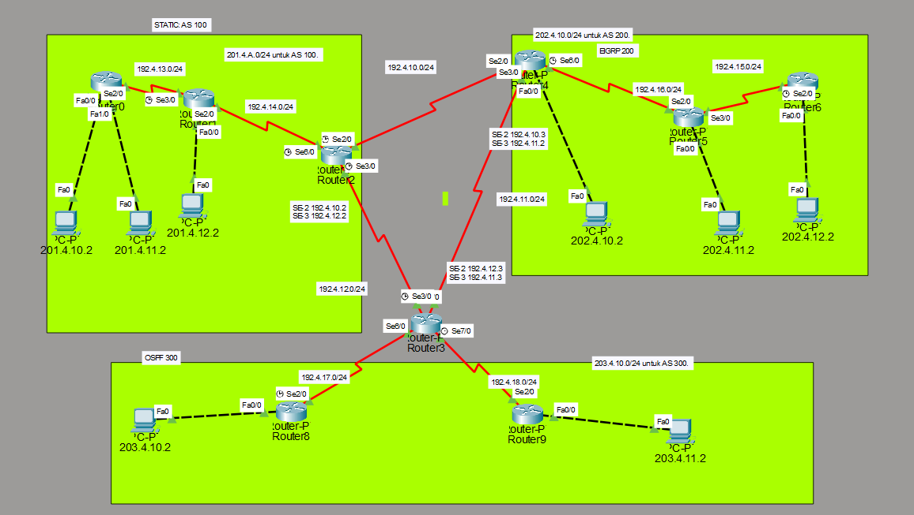

# Cisco Packet Tracer Network Project UJK 25 11 25

## Project Overview
This document provides complete configuration for a multi-protocol network using STATIC, EIGRP, OSPF, and BGP.

---

## Network Topology


---

## IP Addressing Scheme

### Network EIGRP Table

| Network | Network Address | CIDR | Subnet Mask | Purpose | Protocol | SE |
|---------|----------------|------|-------------|---------|----------|----- |
| ROUTER-6 LAN | 202.4.12.0 | /24 | 255.255.255.0 | AS-200 | EIGRP 200 | 192.4.15.0/24
| ROUTER-5 LAN | 202.4.11.0 | /24 | 255.255.255.0 | AS-200 | EIGRP 200 | 192.4.15.0/24 - 192.4.16.0/24 
| ROUTER-4 LAN | 202.4.10.0 | /24 | 255.255.255.0 | EIGRP 200-BRIDGE | EIGRP 200 | 192.4.10.0/24 - 192.4.11.0/24 - 192.4.16.0/24 


### Configuration EIGRP 200 
```shell
ROUTER-6 

router eigrp 200
network 202.4.12.0 0.0.0.255
network 192.4.15.0 0.0.0.255
no auto-summary 

ROUTER-5

router eigrp 200
network 202.4.11.0 0.0.0.255
network 192.4.16.0 0.0.0.255
no auto-summary 


ROUTER-BRIDGE-4 | BGP 200

router eigrp 200
network 202.4.10.0 0.0.0.255
network 192.4.10.0 0.0.0.255
network 192.4.11.0 0.0.0.255
redistribute bgp 200 metric 1544 2000 255 1 1500
no auto-summary 

router bgp 200
! BGP Peer 1 (External BGP - eBGP)
neighbor 192.4.10.2 remote-as 100
! BGP Peer 2 (External BGP - eBGP)
neighbor 192.4.11.3 remote-as 300
redistribute eigrp 200
no auto-summary 
```


### Network OSPF Table

| Network | Network Address | CIDR | Subnet Mask | Purpose | Protocol | SE |
|---------|----------------|------|-------------|---------|----------|----- |
| ROUTER-9 LAN | 203.4.11.0 | /24 | 255.255.255.0 | AS-300 | OSPF 300 | 192.4.18.0/24
| ROUTER-8 LAN | 203.4.10.0 | /24 | 255.255.255.0 | AS-300 | OSPF 300 | 192.4.17.0/24 
| ROUTER-3 LAN | - | /24 | 255.255.255.0 | OSPF 300-BRIDGE | OSPF 300 | 192.4.18.0/24 - 192.4.11.0/24 - 192.4.12.0/24 - 192.4.17.0/24 

### Configuration  300 
```shell
ROUTER-9

router OSPF 300
203.4.11.0 0.0.0.255 area 0
192.4.18.0 0.0.0.255 area 0

ROUTER-8

router OSPF 300
203.4.10.0 0.0.0.255 area 0
192.4.17.0 0.0.0.255 area 0


ROUTER-BRIDGE | BGP 300

router ospf 300
192.4.18.0 0.0.0.255 area 0
192.4.17.0 0.0.0.255 area 0
192.4.11.0 0.0.0.255 area 0
192.4.12.0 0.0.0.255 area 0
redistribute bgp 300 subnets


router bgp 300
neighbor 192.4.11.2 remote-as 200
neighbor 192.4.12.2 remote-as 100
redistribute ospf 300
```

### Network STATIC Table

Here’s your data formatted into a clean **Markdown table**:

### Network Routing Table

| Network         | Network Address | CIDR | Subnet Mask   | Purpose/Role                | Protocol         | Next-Hop/Neighbor   |
|-----------------|-----------------|------|---------------|-----------------------------|------------------|---------------------|
| ROUTER-0 LAN    | 201.4.10.0      | /24  | 255.255.255.0 | Client Network              | Connected/Static | -                   |
| ROUTER-0 LAN    | 201.4.11.0      | /24  | 255.255.255.0 | Client Network              | Connected/Static | -                   |
| ROUTER-1 LAN    | 201.4.12.0      | /24  | 255.255.255.0 | Client/Router Network       | Connected/Static | -                   |
| Link to Router 1| 192.4.14.0      | /24  | 255.255.255.0 | Transit Link (R0 via R1)    | Static Route     | via 192.4.13.3 (R-1)|
| Link to Router 2| 192.4.12.0      | /24  | 255.255.255.0 | Transit Link (R0 via R2)    | Static Route     | via 192.4.13.3 (R-1)|
| Default Route   | 0.0.0.0         | /0   | 0.0.0.0       | Internet/Gateway            | Static Route     | via 192.4.13.3 (R-1)|
| BGP Peer 1      | 192.4.10.3      | -    | -             | eBGP Neighbor               | BGP 100          | Remote-AS 200       |
| BGP Peer 2      | 192.4.12.3      | -    | -             | eBGP Neighbor               | BGP 100          | Remote-AS 300       |

---

### Configuration  300 
```shell
ROUTER-0

interface [LAN Interface]
 ip address 201.4.10.1 255.255.255.0
interface [LAN Interface 2]
 ip address 201.4.11.1 255.255.255.0

! Static routes pointing to 192.4.13.3 (likely ROUTER-1)
ip route 192.4.14.0 255.255.255.0 192.4.13.3
ip route 192.4.12.0 255.255.255.0 192.4.13.3
ip route 0.0.0.0 0.0.0.0 192.4.13.3

ROUTER-1

interface [Link to R-0]
 ip address 192.4.13.2 255.255.255.0

! Static routes pointing to 192.4.13.2 (likely ROUTER-0)
ip route 201.4.10.0 255.255.255.0 192.4.13.2
ip route 201.4.11.0 255.255.255.0 192.4.13.2
ip route 0.0.0.0 0.0.0.0 192.4.14.3

ROUTER-BRIDGE | BGP 100

! Static routes pointing to 192.4.14.2 (likely ROUTER-1)
ip route 201.4.10.0 255.255.255.0 192.4.14.2
ip route 201.4.11.0 255.255.255.0 192.4.14.2
ip route 201.4.12.0 255.255.255.0 192.4.14.2
ip route 201.4.13.0 255.255.255.0 192.4.14.2

! Two default routes (This configuration is unusual and may be for path selection)
ip route 0.0.0.0 0.0.0.0 192.4.10.3
ip route 0.0.0.0 0.0.0.0 192.4.12.3

router bgp 100
 ! eBGP Peer 1
 neighbor 192.4.10.3 remote-as 200
 ! eBGP Peer 2
 neighbor 192.4.12.3 remote-as 300
 
 ! Share static routes learned or configured on ROUTER-2 with BGP neighbors
 redistribute static
```

## Verification Commands

### EIGRP Verification

```cisco
show ip eigrp neighbors
show ip eigrp topology
show ip route eigrp
show ip protocols
debug eigrp packets
```

### OSPF Verification

```cisco
show ip ospf neighbor
show ip ospf database
show ip route ospf
show ip protocols
show ip ospf interface
```

### BGP Verification

```cisco
show ip bgp summary
show ip bgp neighbors
show ip bgp
show ip route bgp
```

### General Verification

```cisco
show ip interface brief
show running-config
show vlan brief
show interfaces trunk
ping 192.4.3.2 (from CLIENT-A)
traceroute 192.4.3.2
```

### VLAN Verification

```cisco
show vlan brief
show interfaces switchport
show interfaces trunk
show spanning-tree
```

---

## Troubleshooting Guide

### Common Issues

| Issue | Possible Cause | Solution |
|-------|---------------|----------|
| No connectivity | Interface down | Check `no shutdown` on interfaces |
| EIGRP neighbors not forming | Wrong AS number | Verify AS 111 on both routers |
| Telnet fails | Wrong password | Verify VTY password |
| VLAN not working | Wrong VLAN assignment | Check switchport configuration |
| BGP not establishing | Wrong AS numbers | Verify neighbor AS configuration |

### Troubleshooting Commands

```cisco
show ip interface brief
show controllers serial 2/0
show cdp neighbors
show ip route
debug ip routing
debug eigrp packets
debug ip ospf events
debug ip bgp
```

---

## Testing Procedures

### 1. Basic Connectivity Test
```
CLIENT-A> ping 192.4.2.1
CLIENT-A> ping 192.4.1.2
CLIENT-A> ping 192.4.3.1
CLIENT-A> ping 192.4.3.2
```

### 2. Routing Protocol Test
```
ROUTER-A# show ip eigrp neighbors
ROUTER-A# show ip route
```

### 3. Telnet Access Test
```
CLIENT-A> telnet 192.4.2.1
Username: (if configured)
Password: cisco123
ROUTER-A> enable
Password: class123
```

### 4. VLAN Functionality Test
```
SWITCH-A# show vlan brief
SWITCH-A# show interfaces trunk
```

---

## Network Security Considerations

1. **Change default passwords** in production environment
2. **Use SSH instead of Telnet** for encrypted remote access
3. **Implement ACLs** to restrict management access
4. **Enable logging** for security monitoring
5. **Use enable secret** instead of enable password
6. **Implement port security** on switch access ports

---

## Quick Reference

### Login Credentials

| Device | Username | Password | Enable Secret |
|--------|----------|----------|---------------|
| All Routers | N/A | cisco123 (VTY) | class123 |
| All Switches | N/A | cisco123 (VTY) | class123 |

### Key IP Addresses

- **ROUTER-A LAN:** 192.4.2.1
- **ROUTER-B LAN:** 192.4.3.1
- **WAN Link:** 192.4.1.1 ↔ 192.4.1.2
- **CLIENT-A:** 192.4.2.2
- **CLIENT-B:** 192.4.3.2

### Routing Protocols Active

- **Primary:** EIGRP AS 111
- **Secondary:** OSPF Process 1, Area 0
- **External:** BGP AS 65001 ↔ AS 65002

---

## Additional Notes

- Serial interface on ROUTER-A is configured as DCE (clock rate set)
- ROUTER-B serial interface is DTE (no clock rate needed)
- All routing protocols can run simultaneously (not typical in production)
- EIGRP is primary routing protocol for this topology
- BGP is configured for inter-AS routing practice
- VLANs require Layer 3 switch or router-on-a-stick for inter-VLAN routing

---

## Project Completion Checklist

- [x] All IP addresses configured correctly
- [x] All interfaces in "up/up" state
- [x] EIGRP neighbors established
- [x] OSPF neighbors established
- [x] STATIC neighbors established
- [x] Full connectivity between Protocols
- [x] Configuration saved on all devices
- [x] Documentation completed
- [x] Network tested and verified

---

**Document Version:** 1.0  
**Last Updated:** November 26, 2025  
**Project Type:** Cisco Packet Tracer Educational Lab