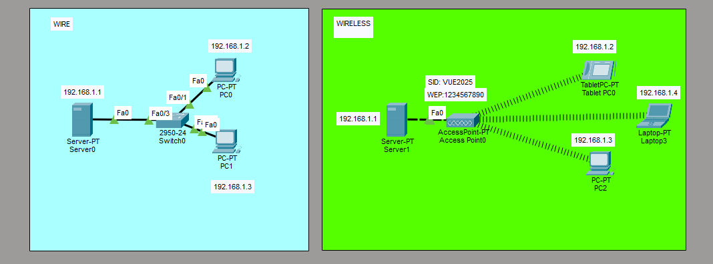

# Network Documentation - Wire & Wireless Topology

## Network Overview

---
| Network Type | Network ID | Subnet Mask | Gateway | Total Devices |
|--------------|------------|-------------|---------|---------------|
| WIRE | 192.168.1.0/24 | 255.255.255.0 | 192.168.1.1 | 5 devices |
| WIRELESS | 192.168.1.0/24 | 255.255.255.0 | 192.168.1.1 | 5 devices |

---

## Complete Device Inventory

| Network | Device Name | Device Type | IP Address | MAC/SSID | Interface | Connection |
|---------|-------------|-------------|------------|----------|-----------|------------|
| WIRE | Server0 | Server | 192.168.1.1 | - | Fa0 | Switch |
| WIRE | Switch0 | 2960-24 Switch | - | - | Fa0, Fa0/1, Fa0/3, Fa1/1 | Multiple |
| WIRE | PC0 | Workstation | 192.168.1.2 | - | Fa0 | Switch |
| WIRE | PC1 | Workstation | 192.168.1.3 | - | Fa0 | Switch |
| WIRELESS | Server1 | Server | 192.168.1.1 | - | Fa0 | Access Point |
| WIRELESS | AccessPoint0 | Access Point | - | SSID: VUE2025<br>WEP: 1234567890 | Fa0 | Wireless |
| WIRELESS | Tablet PC0 | Tablet | 192.168.1.2 | - | Wireless | Access Point |
| WIRELESS | PC2 | Workstation | 192.168.1.3 | - | Wireless | Access Point |
| WIRELESS | Laptop3 | Laptop | 192.168.1.4 | - | Wireless | Access Point |

---

## WIRE Network Details

### Network Configuration
- **Network:** 192.168.1.0/24
- **Gateway:** 192.168.1.1 (Server-PT)
- **Switch Model:** 2960-24
- **Topology:** Star with central switch

### Device Details - WIRE

| Device | IP Address | Port | Connected To | Status |
|--------|------------|------|--------------|--------|
| Server-PT (Server0) | 192.168.1.1 | Fa0 | Switch0 Fa0 | Active |
| 2960-24 (Switch0) | - | Fa0 | Server0 | Active |
| 2960-24 (Switch0) | - | Fa0/1 | PC0 | Active |
| 2960-24 (Switch0) | - | Fa0/3 | PC1 | Active |
| PC-PT (PC0) | 192.168.1.2 | Fa0 | Switch0 Fa0/1 | Active |
| PC-PT (PC1) | 192.168.1.3 | Fa0 | Switch0 Fa0/3 | Active |

### Switch Configuration

```cisco
hostname Switch0
!
interface FastEthernet0/0
 description Connection to Server0
 switchport mode access
 no shutdown
!
interface FastEthernet0/1
 description Connection to PC0
 switchport mode access
 no shutdown
!
interface FastEthernet0/3
 description Connection to PC1
 switchport mode access
 no shutdown
```

---

## WIRELESS Network Details

### Network Configuration
- **Network:** 192.168.1.0/24
- **Gateway:** 192.168.1.1 (Server-PT)
- **Access Point:** VUE2025
- **Security:** WEP
- **WEP Key:** 1234567890
- **Topology:** Infrastructure mode

### Wireless Access Point Configuration

| Parameter | Value |
|-----------|-------|
| SSID | VUE2025 |
| Security Type | WEP |
| WEP Key | 1234567890 |
| Mode | Infrastructure |
| IP Assignment | DHCP from Server |

### Device Details - WIRELESS

| Device | Device Type | IP Address | Connection Type | SSID | Status |
|--------|-------------|------------|-----------------|------|--------|
| Server-PT (Server1) | Server | 192.168.1.1 | Wired (Fa0) | - | Active |
| AccessPoint-PT | Access Point | - | Wireless | VUE2025 | Broadcasting |
| TabletPC-PT (Tablet PC0) | Tablet | 192.168.1.2 | Wireless | VUE2025 | Connected |
| PC-PT (PC2) | Workstation | 192.168.1.3 | Wireless | VUE2025 | Connected |
| Laptop-PT (Laptop3) | Laptop | 192.168.1.4 | Wireless | VUE2025 | Connected |

### Wireless Client Configuration

**For all wireless devices:**
```
SSID: VUE2025
Security: WEP
WEP Key: 1234567890
IP Configuration: DHCP or Static
Gateway: 192.168.1.1
```

---

## IP Address Allocation

### WIRE Network IPs

| IP Address | Device | Type | Port/Interface |
|------------|--------|------|----------------|
| 192.168.1.1 | Server0 | Server/Gateway | Fa0 |
| 192.168.1.2 | PC0 | Workstation | Fa0 |
| 192.168.1.3 | PC1 | Workstation | Fa0 |
| 192.168.1.4-254 | Available | - | - |

### WIRELESS Network IPs

| IP Address | Device | Type | Connection |
|------------|--------|------|------------|
| 192.168.1.1 | Server1 | Server/Gateway | Wired Fa0 |
| 192.168.1.2 | Tablet PC0 | Tablet | Wireless |
| 192.168.1.3 | PC2 | Workstation | Wireless |
| 192.168.1.4 | Laptop3 | Laptop | Wireless |
| 192.168.1.5-254 | Available | - | - |

---

## Network Topology Diagrams

### WIRE Network Topology
```
                    [Server0]
                   192.168.1.1
                        |
                     Fa0|Fa0
                        |
                   [Switch0]
                   2960-24
                   /      \
              Fa0/1        Fa0/3
              /              \
          [PC0]            [PC1]
       192.168.1.2      192.168.1.3
```

### WIRELESS Network Topology
```
                    [Server1]
                   192.168.1.1
                        |
                     Fa0|Fa0
                        |
                [AccessPoint0]
                 SSID: VUE2025
                 WEP: 1234567890
                        |
        ~~~~~~~~~~~~~~~~|~~~~~~~~~~~~~~~~
       /                |                \
   [Tablet]          [PC2]          [Laptop3]
  192.168.1.2    192.168.1.3      192.168.1.4
```

---

## Configuration Guide

### Server Configuration (Both Networks)

```
IP Address: 192.168.1.1
Subnet Mask: 255.255.255.0
Default Gateway: N/A (Server is gateway)
DNS: 192.168.1.1
Services: DHCP, DNS (if enabled)
```

### PC Configuration (WIRE)

**PC0:**
```
IP Address: 192.168.1.2
Subnet Mask: 255.255.255.0
Default Gateway: 192.168.1.1
```

**PC1:**
```
IP Address: 192.168.1.3
Subnet Mask: 255.255.255.0
Default Gateway: 192.168.1.1
```

### Wireless Device Configuration

**Tablet PC0:**
```
IP Address: 192.168.1.2
Subnet Mask: 255.255.255.0
Default Gateway: 192.168.1.1
SSID: VUE2025
Security: WEP
Key: 1234567890
```

**PC2:**
```
IP Address: 192.168.1.3
Subnet Mask: 255.255.255.0
Default Gateway: 192.168.1.1
SSID: VUE2025
Security: WEP
Key: 1234567890
```

**Laptop3:**
```
IP Address: 192.168.1.4
Subnet Mask: 255.255.255.0
Default Gateway: 192.168.1.1
SSID: VUE2025
Security: WEP
Key: 1234567890
```

---

## Testing and Verification

### WIRE Network Tests

**From PC0:**
```
ping 192.168.1.1    (Test Server0)
ping 192.168.1.3    (Test PC1)
```

**From PC1:**
```
ping 192.168.1.1    (Test Server0)
ping 192.168.1.2    (Test PC0)
```

### WIRELESS Network Tests

**From Tablet PC0:**
```
ping 192.168.1.1    (Test Server1)
ping 192.168.1.3    (Test PC2)
ping 192.168.1.4    (Test Laptop3)
```

**From PC2:**
```
ping 192.168.1.1    (Test Server1)
ping 192.168.1.2    (Test Tablet PC0)
ping 192.168.1.4    (Test Laptop3)
```

**From Laptop3:**
```
ping 192.168.1.1    (Test Server1)
ping 192.168.1.2    (Test Tablet PC0)
ping 192.168.1.3    (Test PC2)
```

---

## Connectivity Matrix

### WIRE Network

| From | To | Expected Result |
|------|----|----|
| PC0 | Server0 (192.168.1.1) | ✅ Success |
| PC0 | PC1 (192.168.1.3) | ✅ Success |
| PC1 | Server0 (192.168.1.1) | ✅ Success |
| PC1 | PC0 (192.168.1.2) | ✅ Success |

### WIRELESS Network

| From | To | Expected Result |
|------|----|----|
| Tablet PC0 | Server1 (192.168.1.1) | ✅ Success |
| Tablet PC0 | PC2 (192.168.1.3) | ✅ Success |
| Tablet PC0 | Laptop3 (192.168.1.4) | ✅ Success |
| PC2 | Server1 (192.168.1.1) | ✅ Success |
| Laptop3 | Server1 (192.168.1.1) | ✅ Success |

---

## Security Considerations

### WIRE Network
- ✅ Physical security (cable access)
- ✅ Switch port security can be enabled
- ✅ No wireless security concerns
- ⚠️ Consider enabling port security on switch

### WIRELESS Network
- ⚠️ **WEP is deprecated and insecure**
- 🔒 **Recommendation:** Upgrade to WPA2 or WPA3
- ⚠️ SSID is broadcast (VUE2025)
- ⚠️ No MAC filtering enabled
- ⚠️ WEP key is weak encryption

**Recommended Wireless Security Upgrades:**
1. Change from WEP to WPA2-PSK or WPA3
2. Use strong passphrase (minimum 12 characters)
3. Consider hiding SSID broadcast
4. Implement MAC address filtering
5. Regular password rotation

---

## Network Summary

### WIRE Network
- **Type:** Wired Ethernet
- **Devices:** 3 (1 Server, 2 PCs)
- **Infrastructure:** 1 Switch (2960-24)
- **Security:** Physical access control
- **Status:** ✅ Operational

### WIRELESS Network
- **Type:** 802.11 Wireless
- **Devices:** 4 (1 Server, 3 Wireless clients)
- **Infrastructure:** 1 Access Point
- **SSID:** VUE2025
- **Security:** WEP (⚠️ Needs upgrade)
- **Status:** ✅ Operational

---

## Troubleshooting Guide

### WIRE Network Issues

| Issue | Cause | Solution |
|-------|-------|----------|
| No connectivity | Cable unplugged | Check all cable connections |
| PC can't reach server | Wrong gateway | Verify gateway is 192.168.1.1 |
| Switch ports not working | Port disabled | Check port status on switch |

### WIRELESS Network Issues

| Issue | Cause | Solution |
|-------|-------|----------|
| Can't connect to WiFi | Wrong SSID | Verify SSID is VUE2025 |
| Authentication failed | Wrong WEP key | Verify key: 1234567890 |
| Weak signal | Distance/obstacles | Move closer to Access Point |
| No IP address | DHCP issue | Check server DHCP settings |

---

## Best Practices Applied

✅ **Organized network segmentation** (Wire vs Wireless)  
✅ **Consistent IP addressing** scheme  
✅ **Central gateway** for both networks  
✅ **Documented configurations**  
⚠️ **Security needs improvement** (WEP upgrade needed)

---

**Document Status:** Complete  
**Network Status:** Operational  
**Security Assessment:** Needs WEP to WPA2/WPA3 upgrade  
**Last Updated:** December 2024